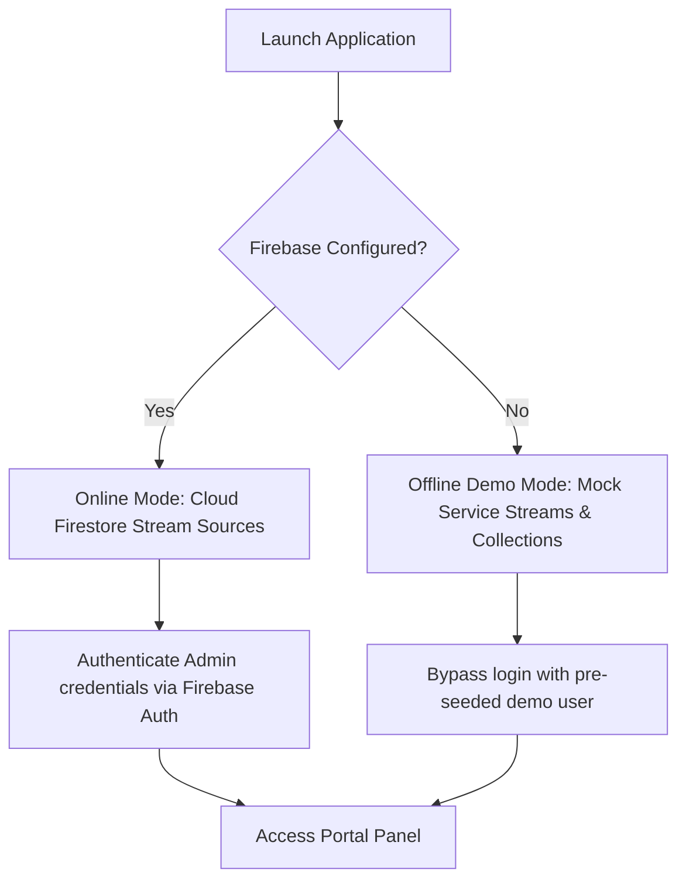

# Lyallpur Telecom Broadband Portal

A premium, real-time client billing, package subscriptions, and connection management dashboard built with Flutter and Cloud Firebase. 

Designed with a high-fidelity visual layout, the Lyallpur Telecom Broadband Portal enables service providers to manage customer profiles, subscription states, area coverage, and billing logs seamlessly from a unified web and mobile interface.

---

## ⚡ Highlights & Features

*   **Real-Time Status Console (Dashboard)**
    *   Dynamic counters tracking **Total Clients**, **Active Connections**, **Expired Subscriptions**, and **Total Pending Dues**.
    *   Micro-animations and skeleton loading shimmers for high-end feel.
    *   Direct PKRs currency formatting system.
*   **Dual-Mode Backend Engine**
    *   **Online Mode**: Full Cloud Firestore integration tracking real-time client updates, transaction history, and subscription renewals.
    *   **Offline Demo Mode**: Self-healing mock service engine that triggers if Firebase options are missing, providing populated test data for demo exploration.
*   **Advanced Client Lifecycle Ledger**
    *   Full client registration (names, active phones, connection dates, custom packages).
    *   Automated billing calculations with full payments logging and remaining dues processing.
    *   Filtered searching and live connection logs.
*   **Coverage Area Directory**
    *   Centralized system to allocate clients and track router density across multiple sectors (e.g., Samanabad, Batala Colony, Peoples Colony).
*   **Stream Caching & Zero-Delay Routing**
    *   Persistent broadcast streams sync data in the background, eliminating page navigation latency.
    *   Zero-duration PageRoute transitions for snappy sidebar navigations.

---

## 🏗️ Dual-Mode Architecture

The application uses an intelligent runtime switch. If Firebase configuration is missing or throws an initialization error, the services fall back to the built-in offline engine so users can view and interact with the application immediately.



---

## 📂 Project Structure

```
lib/
 ├── models/                 # Strong data models & typed abstractions
 │    ├── area.dart          # Connection areas structure
 │    ├── client.dart        # Customer entity (bills, dates, packages)
 │    └── package.dart       # Available bandwidth speed packages
 ├── screens/                # UI screens matching dashboard routes
 │    ├── area_screen.dart
 │    ├── client_detail_screen.dart
 │    ├── clients_screen.dart
 │    ├── dashboard_screen.dart
 │    ├── history_screen.dart
 │    ├── login_screen.dart
 │    └── new_client_screen.dart
 ├── services/               # Core business logic & database queries
 │    └── firebase_service.dart # Stream Cache Engine + Mock Stream Controller
 ├── widgets/                # Core reusable layout containers
 │    ├── responsive_scaffold.dart
 │    └── sidebar.dart       # Sidebar navigation menu
 ├── main.dart               # App entrypoint, theme applier, routing switch
 └── theme.dart              # Custom AppTheme system with Poppins Google Font
```

---

## 🎨 Visual Identity & Style

The project adopts a dark UI, mirroring high-fidelity developer dashboards.
*   **Primary Background**: Dark Slate (`#0D1117`)
*   **Accent Color**: Deep Blue (`#185FA5`)
*   **Highlight Color**: Vibrant Light Blue (`#54C5F8`)
*   **Font Family**: Google Fonts: Poppins (provides a clean, geometric visual rhythm)
*   **Interactive Cards**: Defined dark border style (`#30363D`) and sleek container backgrounds (`#21262D`).

---

## 🚀 Getting Started

### Prerequisites

*   Install the [Flutter SDK](https://docs.flutter.dev/get-started/install) (version `>=3.9.2`).
*   Configure the Android/iOS toolchains, or Google Chrome for web testing.

### Setup & Run

1.  **Clone the project repository**
    ```bash
    git clone <repository-url>
    cd internet-management
    ```

2.  **Restore dependencies**
    ```bash
    flutter pub get
    ```

3.  **Run in Offline Demo Mode (Default)**
    Simply start the development runner. Without configured keys, it will launch the offline mock dashboard:
    ```bash
    flutter run
    ```

4.  **Connect Your Own Firebase Backend**
    To use your custom cloud database instead of the offline simulation mode:
    *   Install the [FlutterFire CLI](https://firebase.flutter.dev/docs/cli).
    *   Log in to your account and configure the project:
        ```bash
        flutterfire configure
        ```
    *   This generates the necessary configuration under `lib/firebase_options.dart`.
    *   Run `flutter run` again. The application will automatically detect the options and connect to Cloud Firestore.

---

## 🔒 Firestore Security Rules

Ensure your Firebase security configuration (`firestore.rules`) allows authorized reads and writes to store real-time data:

```javascript
rules_version = '2';
service cloud.firestore {
  match /databases/{database}/documents {
    match /{document=**} {
      allow read, write: if true; // Configure auth rules for production use
    }
  }
}
```
